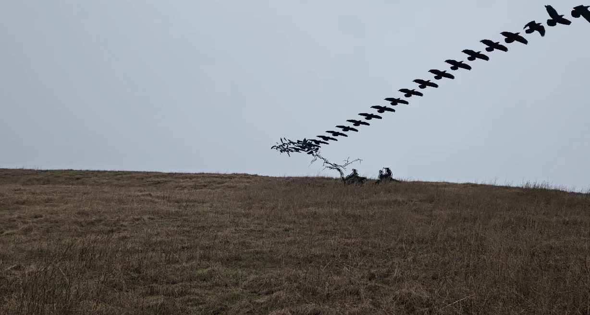
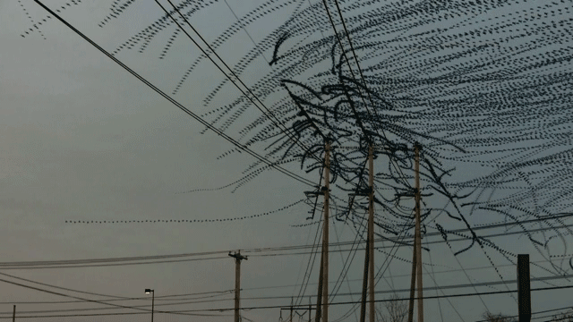

# BIRDFLIGHT



This program is made to turn videos of birds into layered flight trail images.

The site is currently hosted on my personal server. Message me privately for the domain.

### Prior Art


[Xavi Bou's ornithographies](https://xavibou.com/ornithographies/) are the classic still images. These are hand-crafted in photoshop from hundreds of stills, shot usually with a high-speed camera. He also seems to do movies as well.



[Dennis Hlynsky](https://www.thisiscolossal.com/2014/01/amazing-video-clips-visually-isolate-the-flight-paths-of-birds/) makes videos where a certain number of previous frames are visible, and fade out. A cool thing here is he overlays audio recorded from the location.


## Building and Hosting

This can be built into the basic python docker container.

```
docker build -t birdflight:latest .

docker compose up
```

I also use an external bound volume for storing uploaded videos and output files. This can be modified for your own use, as this path might not be the same as mine.

## TODO

Add actual IP banning and rate limiting. Add animation export.

Build the contianer on github actions.